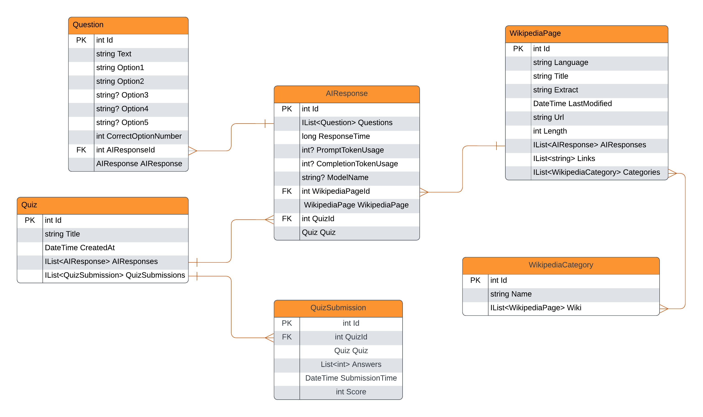

# Wikipedia Quiz Generator

This project generates high-quality quizes based on nearly any topic using Wikipedia and AI.

## Features:
- Dynamic quiz generation utilizing semantic kernel prompt templates  
- Multilingual support for English, Spanish, French, Japanese, Chinese, and more
- Flexible search bar (Entering Apple Company will give you a quiz about Apple Inc.)
- Easy integration with  various AI APIs, currently supporting OpenAI API and the Perplexity API
- ASP.NET Core minimal api for quiz generation and submission (coming soon)

## Requirements:
- Perplexity or OpenAI API key
- Docker

## Instructions:
- Set up the .env file
- Run docker-compose up --build
- Test API at localhost:5543/swagger

## TODO
- Pagination for quiz history
- Rate limit users for production
    - Calculate token usage/cost
- Optimize quiz creation time

