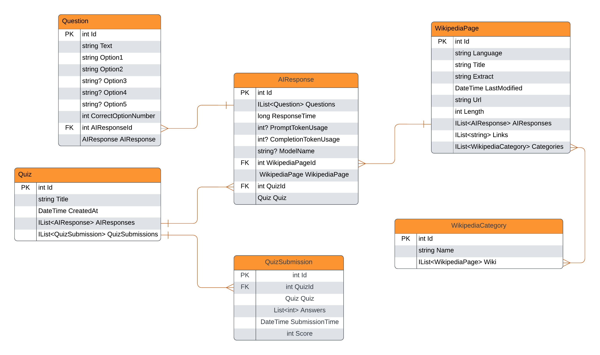

# Wikipedia Quiz Generator

This project generates high-quality quizes based on nearly any topic using Wikipedia and AI.

## Features:
- Dynamic quiz generation utilizing semantic kernel prompt templates  
- Multilingual support for English, Spanish, French, Japanese, Chinese, and more
- Flexible search bar (Entering Apple Company will give you a quiz about Apple Inc.)
- Easy integration with various AI APIs, currently supporting OpenAI API and the Perplexity API
- ASP.NET Core minimal api for quiz generation and submission (coming soon)

## Requirements:
- Perplexity or OpenAI API key
- Docker

## Instructions:
- Set up the .env file with your API key (use the .env.example file) and uncomment your service extension in program.cs of the API
- Run docker-compose up --build
- Test API at localhost:5543/swagger

## Todo:
- Write tests for the repositories
- Add more prompt templates for various languages, difficulties, themes (funny, scientific, etc)
- Hammer out bugs and optimize (write tests!)
- Utilize the links and categories for quiz generation
- Add the basic quiz post endpoint which checks the answers and returns a completedQuiz dto
- Add a user
- Work on the frontend
- Add logic to handle Wikipedia disambiguation pages: https://en.wikipedia.org/wiki/Category:Disambiguation_pages

